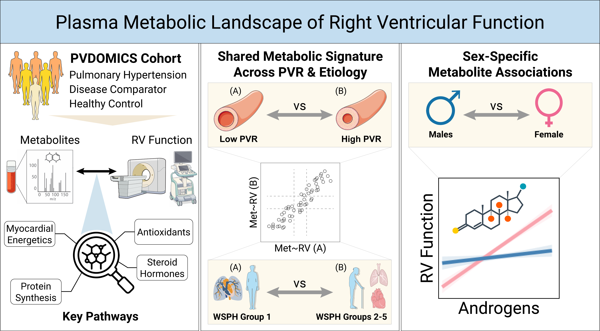

# Metabolomics of Right Ventricular Function in Pulmonary Hypertension

Analysis code for the published paper:

**Metabolomics of Right Ventricular Function in Pulmonary Hypertension**  
Jonathan Chacon-Barahona et al.; PVDOMICS Study Group. *Circulation Research*. 2026 Apr 15. doi: [10.1161/CIRCRESAHA.125.327342](https://doi.org/10.1161/CIRCRESAHA.125.327342). PMID: [41983297](https://pubmed.ncbi.nlm.nih.gov/41983297/).

## Summary

This repository contains the R/Jupyter notebooks and R environment metadata used to analyze metabolomics associations with right ventricular function in pulmonary hypertension. The repository supports transparent review of the analysis workflow without distributing participant-level raw metabolomics or clinical data.

## Graphical Abstract



## Repository Structure

- `notebooks/`: Numbered analysis notebooks for univariate regression, pathway analysis, interaction analyses, MET-RV scores, REVEAL scores, and normality checks.
- `config/`: Non-sensitive analysis configuration.
- `figures/`: Public manuscript figures approved for release, including the graphical abstract.
- `renv.lock`: R package lockfile used to reproduce the package environment.
- `renv/`: `renv` bootstrap files. The local package library is intentionally ignored.
- `data/`: Placeholder only. Raw and processed data files are not included.
- `outputs/`: Placeholder only. Generated spreadsheets and other analysis outputs are not included.
- `metrv_models/`: Placeholder only. Generated model coefficient files are not included.

## Restore the R Environment

Install R and the `renv` package, then restore the package library from the lockfile:

```r
install.packages("renv")
renv::restore()
```

The project `.Rprofile` activates `renv` automatically when the repository is opened in R.

## Running the Notebooks

1. Clone the repository and open the project root in RStudio, Jupyter, or another notebook environment with an R kernel.
2. Restore the R environment with `renv::restore()`.
3. Place approved local copies of the required input data under `data/` using the filenames referenced in the notebooks.
4. Run the notebooks in numeric order from `notebooks/`.

The notebooks are committed without execution outputs so they can be rerun in a controlled local environment.

## Data Availability

Raw metabolomics data, participant-level clinical data, processed metabolomics objects, and derived analysis outputs are not included in this public repository. Data access is governed by the PVDOMICS study and applicable institutional, ethical, and data-use requirements.

## Citation

If you use this repository, please cite:

Jonathan Chacon-Barahona et al.; PVDOMICS Study Group. Metabolomics of Right Ventricular Function in Pulmonary Hypertension. *Circulation Research*. 2026 Apr 15. doi: [10.1161/CIRCRESAHA.125.327342](https://doi.org/10.1161/CIRCRESAHA.125.327342).

## Contact

For questions about this repository, please contact Jonathan Chacon-Barahona via the contact information listed with the published paper or open an issue on the GitHub repository.
